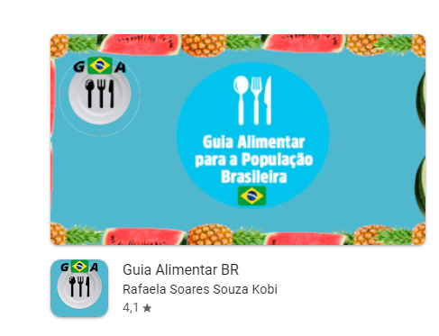
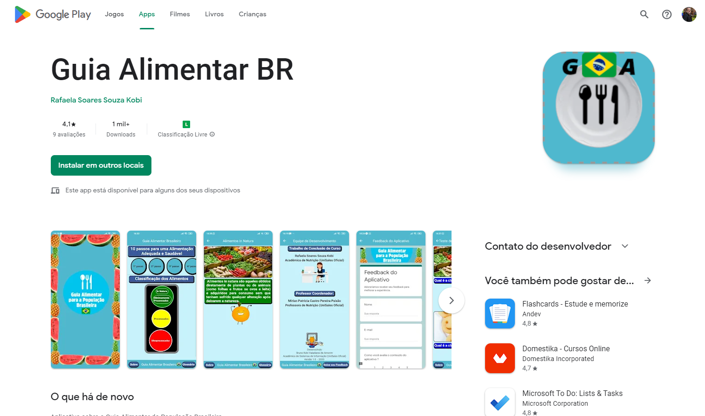

# Guia Alimentar BR
Aplicativo do Guia Alimentar Brasileiro, desenvolvido pra o TCC da aluna de Nutrição Rafaela Soares Souza Kobi , o aplicativo foi desenvolvido em React Native pelo FrameWork Expo e foi Publicado na PlayStore do Google para dispositivos Android.  
Esse Aplicativo é resultado do Trabalho de Conclusão de Curso da acadêmica de Nutrição Rafaela Soares Souza Kobi , que se trata de uma pesquisa transversal que foi construído a partir da avaliação do conhecimento de alunos e profissionais da saúde sobre o guia alimentar para a População Brasileira (2014). Foi feita uma pesquisa com profissionais da saúde através de um questionário digital com estudantes e profissionais da área da saúde, para dar embasamento ao desenvolvimento do aplicativo denominado Guia Alimentar BR, composto por 51 telas, que passa de maneira lúdica o conteúdo de Guia Alimentar para a População Brasileira.  
<a href="https://play.google.com/store/apps/details?id=com.guiaalimentar.guiaalimentarbr">Download Aplicativo PlayStore</a>
      

